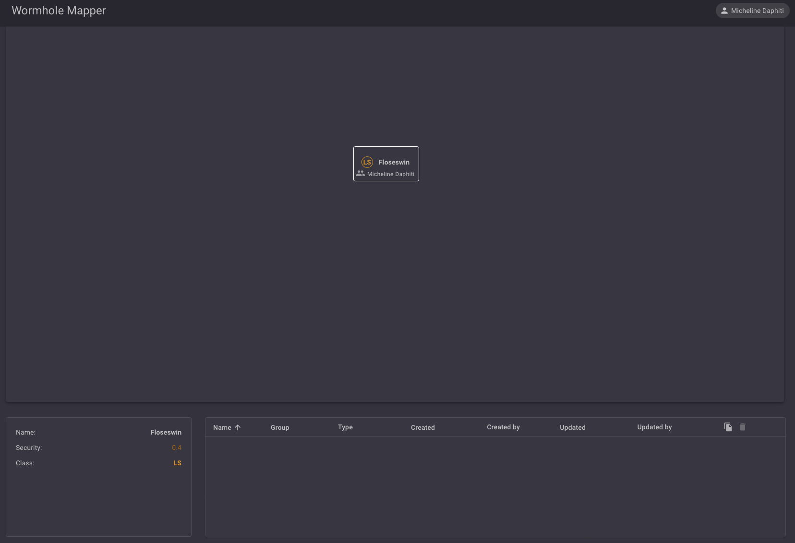
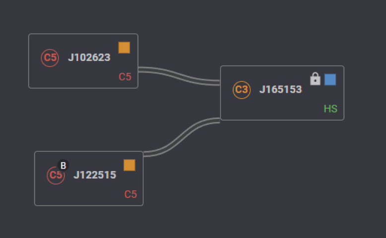

# Map Module

Main map module is devided in three areas :
  - Map view (Top)
  - System informations (Bottom Left) 
  - System signatures (Bottom right)

## Main features

### Auto-mapping 

- Auto-mapping system is following you in game and will add automatically systems depending on your geographical movement between systems.
- When EVE Wormhole mapper open a new wormhole with the same system class than an existing one on the map, a specific alphabetic character is automatically added to facilitate system identification and communication about it.   

- You can use this functionality at your own on every system in the map using UP/DOWN keyboard key or +/- keyboard key to scroll identification letter.

### Map navigation 

- Map are not limits, press left mousse button and move it, to navigate and select your wich region do you to see.
- Map zoom in/out is enable, using your mouse wheel 

## Map systems node and links

- Select unique system node or node (exeception locked system node): 
  - Left click on system node or link

- Multi select system node or link :
    - Press "CTRL" key
    - Left click to add system node or link in the selection

- Moving system node or link (excepted if the system is locked):
    - Press left click
    - move your mouve 

- Add missing systems manually: 
    - Right click in map
    - Select "Add System" menu item
    - Type the three first system name character to fill droplist box
    - Select your system to add

- Add missing link between two systems manually : 
    - Select fist system node
    - Press "CTRL key and select the second system node
    - Press “L” key

- Delete system node or link :
    - Select system nodes or links
    - Press "Del" key to delete all (locked system node can't delete)

- Each system can be “locked” to avoid deleting mistake :
    - Select system
    - Right click 
    - Select "Lock/unlock" menu item

- A system can be used as in game destination :
    - Select system
    - Right click
    - Select "Set destination" menu item
    
- System link status can be updated using several information :
    - Select link
    - Right click 
    - Select status option like :
        - End Of life status (EOL)
        - Mass status (normal, critical, verge)
        - Wormhole size (small, medium, …)
